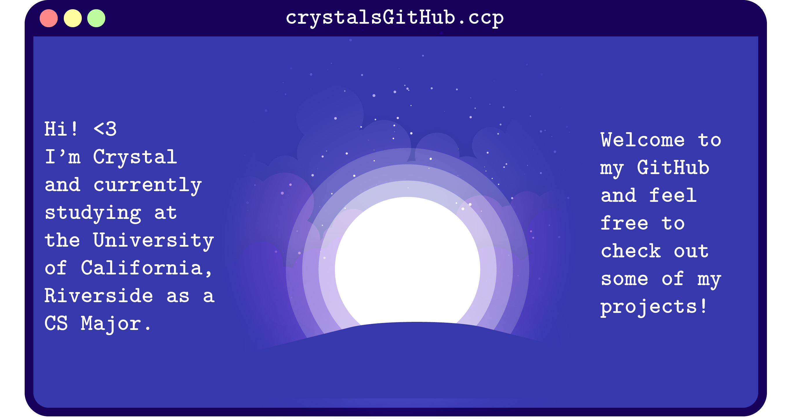

  
  
  
   
  

---

- 🍄 Pursuing a **B.S. in Computer Science** at **University of California, Riverside**
- 🍀 Currently a Operations Lead [@RoseHack2022](https://rosehack.com/) and WebMaster [@GameSpawn](https://gamespawn.github.io/)
- 🌈 Pronouns: [she/her](https://www.mypronouns.org/she-her)
- 🐚 Check out my personal **[website](https://crystlfng.github.io/businesscard/)**
- ✨ I enjoy exploring a learning new creative mediums: Currently diving into front-end dev and game dev

---

### Languages and Technologies

---

  
  

<!--
**crystlfng/crystlfng** is a ✨ _special_ ✨ repository because its `README.md` (this file) appears on your GitHub profile.

Here are some ideas to get you started:

- 🔭 I’m currently working on ...
- 🌱 I’m currently learning ...
- 👯 I’m looking to collaborate on ...
- 🤔 I’m looking for help with ...
- 💬 Ask me about ...
- 📫 How to reach me: ...
- 😄 Pronouns: ...
- ⚡ Fun fact: ...
-->

